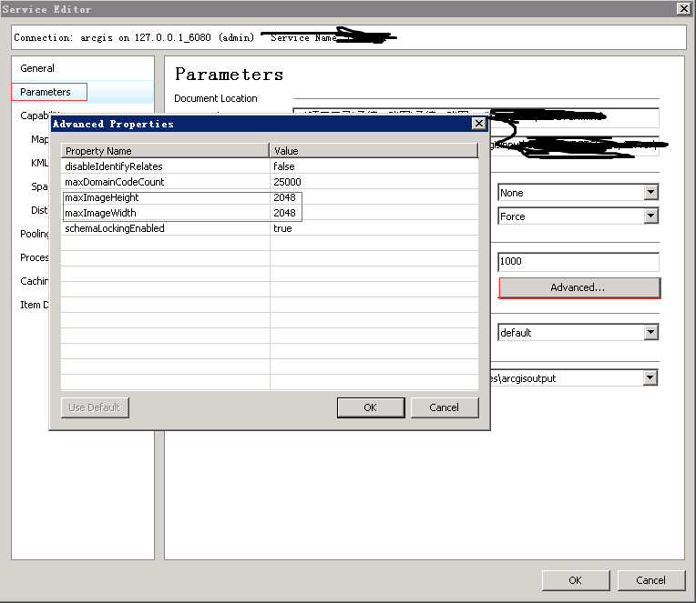
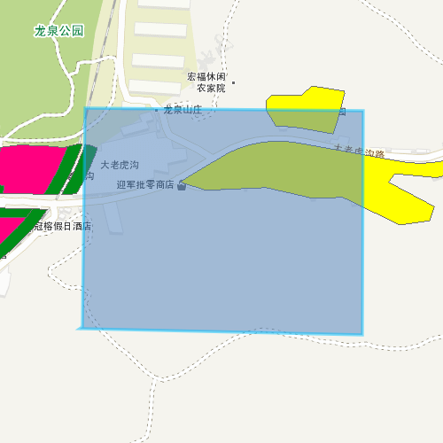
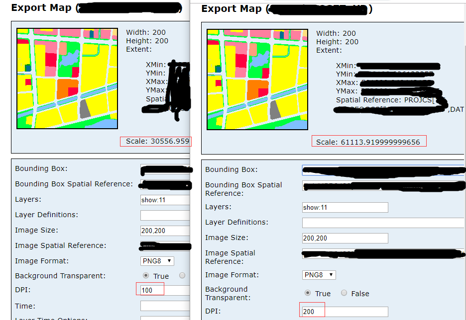
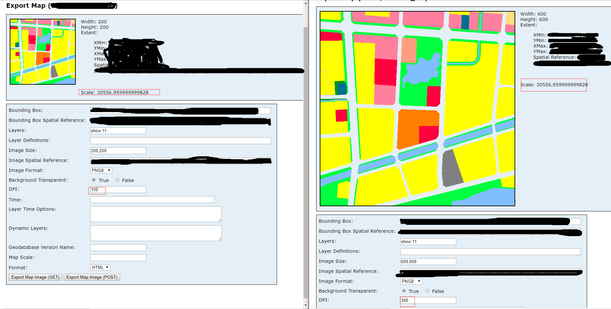

# WMTS服务+Arcgis服务+Graphics图片导出

思路源于[leaflet](https://leafletjs.com/plugins.html#printexport)的一个打印[插件](https://github.com/rowanwins/leaflet-easyPrint)；     
具体实现内容请查看源码。

## 需求
当系统中接入wmts服务时，ArcgisServer自带的打印服务和前端截图插件不能满足需求（截图wmts图层为空白），具体原因就未做深入了；刚好项目碰到这个问题，好几个重要功能都受到影响,因此有了这个解决方案

## 实现

wmts服务添加到map后arcgisapi会根据当前视图计算用于显示瓦片，并通过二维变换让所有图片拼接显示。这些变换的参数在图层对象中都能获取到，根据这些变换参数可以将瓦片手动拼成‘一张图片’。功能主要解决的问题还是资源跨域问题，瓦片要转换为base64编码的图片，然后拼合成一张图片，最后在使用前端截图插件`dom-to-image`或`html2canvas`进行图片生成。

1、初始化map对象，div显示层级为负，设置map的`中心点`和`比例尺`  
2、添加底图和要素图形   
- 有wmts   
为保证wmts服务的瓦片获取正确无误，必须全部添加到map上，监听每个服务的`update-end`事件，不添加arcgis服务
- 无wmts   
arcgis服务只需添加一个即可，我们只是需要map初始化完成后的extent，监听服务的`load`事件   

3、待上述事件全部抛出，开始打印准备，创建打印根节点元素(层级设为负)   
- wmts服务瓦片获取并转为base64，拼合做位置变换，完成后返回服务图片容器的元素节点
- arcgis服务export图片，dpi、bbox、height、width、sr、visibleLayers，每个服务都要进行请求，都完成后返回服务图片容器的元素节点

4、将3中返回的元素加入打印根结点元素，克隆map中要素图层的svg元素，加入打印根节点元素   
5、使用截图插件出图，让完成事件抛出


## 使用场景

系统接入WMTS服务   
- 地图图片导出
- 地图打印
- ...

也支持arcgis动态服务和切片服务（统一使用export出图），但是推荐使用打印的GP服务，速度可能会快点

## 使用说明   

使用到的插件：arcgisapi 3.x（dojo）、html2canvas、jquery、FileSaver、canvg(ie)以及以上内容的依赖  (**查看plugins文件夹**)

为兼容性使用html2canvas输出base64图片；插件引入路径在源码中可根据实际情况修改。


## 参数
### option:

- center、scale必传
- WMTSLayers、ArcLayers两个参数至少一个有内容

| 参数       | 说明                                                                                                                                              |
| ---------- | ------------------------------------------------------------------------------------------------------------------------------------------------- |
| center     | 地图的中心点                                                                                                                                      |
| scale      | 地图的比例尺                                                                                                                                      |
| WMTSLayers | wmts图层数组，传入实例化图层（实例化方式不同，故传入实例化后的图层对象，省去适配）(增加导出透明度设置exportOpacity，无需求可不设置，见例子中使用) |
| ArcLayers  | 非ogc标准的arcgis服务,传入服务的url,visibleLayers,layersOpacity（服务地址，可见图层id（递增）, 对应图层透明度(无需求可不传)）                     |
| graphics   | Graphic数组（如图形未带样式，则使用默认）                                                                                                         |
| height     | 图片高度                                                                                                                                          |
| width      | 图片宽度                                                                                                                                          |
| dpi        | 用于export接口导出图片的精度设置(默认96)                                                                                                          |
| imgExt     | 指定图片的格式                                                                                                                                    |
| proxyUrl   | 代理地址（仅用于wmts瓦片请求），可不传                                                                                                            |

### 事件
- `export-success`：成功导出事件

### 方法
- `downLoad(base64Url)` ：将上述事件接收的返回值传入即可下载(依赖FileSaver.js)


### 实例化

项目中引入`ExportMapImg.js`即可使用
```javascript
var wmtslayer = new WMTS(url,...);
wmtslayer.exportOpacity = 0.8;
var exportImg = new ExportMapImg({
        center: this.map.extent.getCenter(),
        scale: this.map.getScale(),
        WMTSLayers: [wmtslayer],
        ArcLayers: [{url:'http://127.0.0.1:6080/arcgis/rest/services/XXX/XXX/MapServer',visibleLayers:[101,102],layersOpacity:[0.8,0.5]}],
        dpi: this.dpi,
        width: width,
        height: height    
    });
    on.once(exportImg, 'export-success', function (url) {
        exportImg.downLoad(url);
        exportImg = null;
    });
```

**[注]export接口默认支持最大2048px*2048px的图片输出，需修改服务设置以支持更大尺寸的图片输出**    



## IE支持Graphic图层输出

html2canvas在ie中使用不支持svg的输出；   
在不借助插件和后台服务的情况下，将svg输出为Blob地址和svgbase64地址赋给img，然后绘制在canvas会出现跨域而污染画布不能使用`toBlob()、toDataURL()、getImageData()`；     

为了兼容这里选择引入插件`canvg.js`，以及canvg的依赖`rgbcolor.js、stackblur-canvas.js`，在plugins目录下，请在项目中**使用该方法之前**引用 

借助后台解决跨域污染对svg无效`IEtest/index.jsp`（一个传入什么返回什么的接口）   

**不借助插件和后台得到base64png图片源，如果有这方面的解决方案请务必告知一下；这里我提供一个ie的相关测试页面，使用一下就会知道问题的所在（`IEtest/test.html`）**

## 效果

- wmts+动态图层+Graphics   
 

## DPI相关

dpi=96:每英寸点数   
1in=2.54cm   

- 一般情况下，提高export接口导出图片的精度，如下图：单纯提高dpi。从结果来看范围是一致了，但是出图的比例尺变化了

- 将dpi和尺寸乘以相同倍数，如下图：导出范围一致，比例尺一致  


举例：
- 假如需要打印一张照片2inX2in（dpi=100）这时像素尺寸应为200pxX200px
- 假如需要还需要打印一张照片2inX2in (dpi=300) 这时像素尺寸应为600pxX600px
当只有像素尺寸200pxX200px图片，打印时以dpi=300输出，打印机会进行栅格化处理，将（200px→600px）X (200px→600px)输出打印，这种情况下打印的照片应该会出现平时所说的马赛克 

以上内容个人见解，正确性未知；为什么要讲这个内容？   
因为wmts服务切片一般都是默认的dpi=96，所以想要输出更高精度的图片，也就和上面例子中一样，要将切片栅格化放大处理后，在输出，结果就是严重失真   
因此对更高dpi未做支持，初始化参数中有这个内容，那只有arcgis服务export接口会使用到，传高了服务返回还会变慢，所以默认96；

**声明：以上成果均为个人兴趣所为，与开发时所在公司无任何关系**